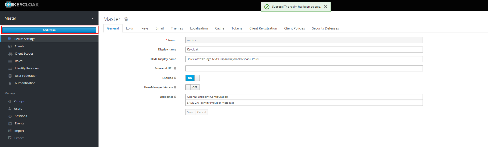
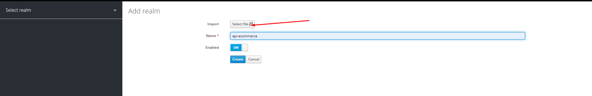
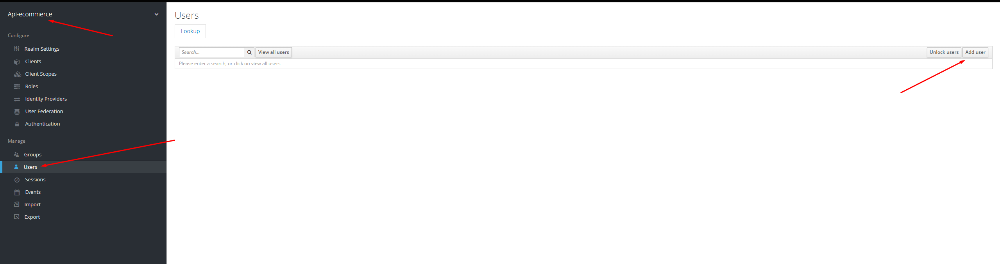
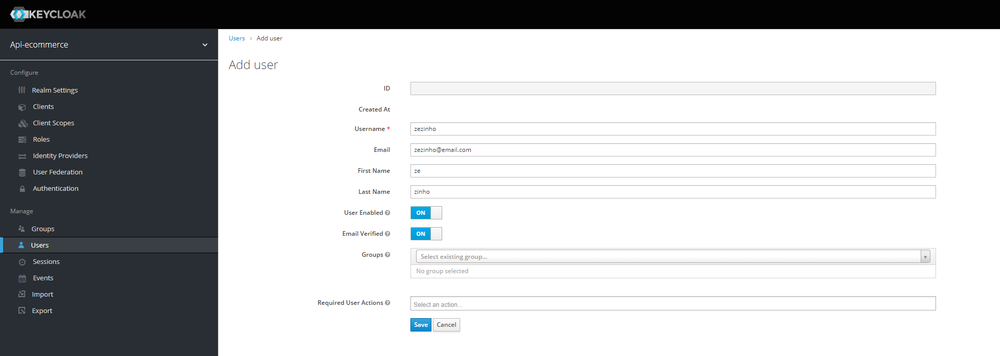
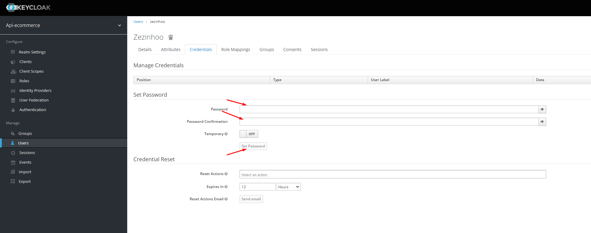

# Passos para configuração do keycloak

Acessar http://localhost:18080/, clicar em "Administrator Console" e digitar as credenciais preenchidas no docker-compose, que por padrão são:

```yml
      KEYCLOAK_USER: admin
      KEYCLOAK_PASSWORD: Pa55w0rd
```

Com o mouse por cima do "Master" selecionar a opção "Add realm"



Selecionar a opção "Select file" e selecionar o arquivo "realm-export.json" disponível na raiz desse projeto e então clicar em "create"



No Realm Api-ecommerce clicar na aba users e em Add user



Preencher os dados do novo usuário



Na aba credencials escolher uma senha para esse usuário

